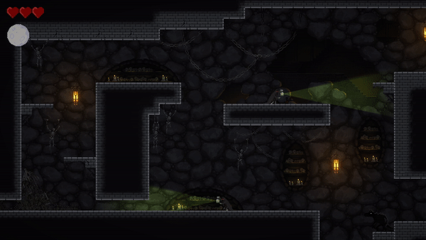
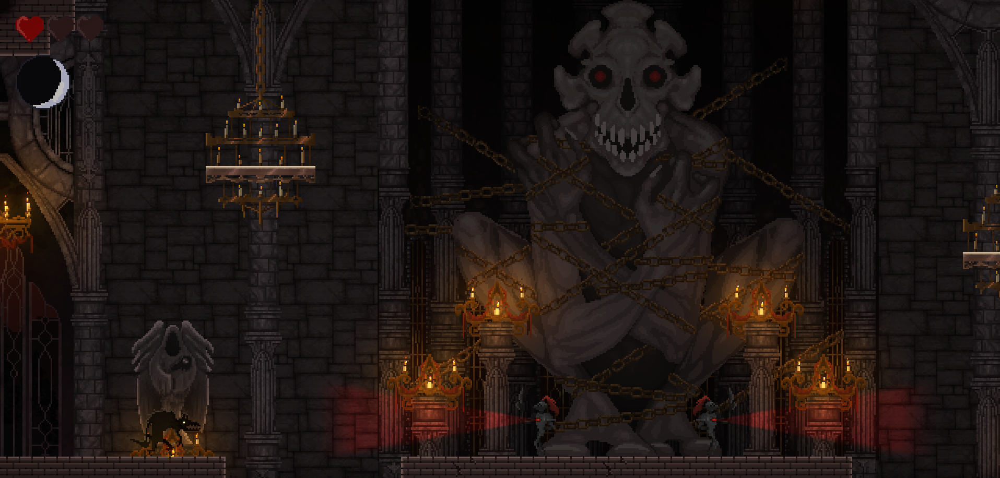
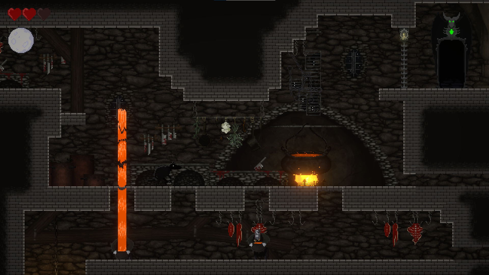
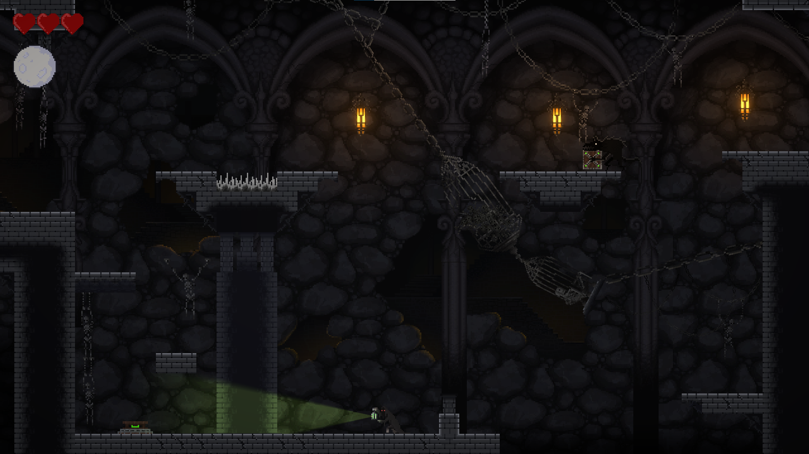
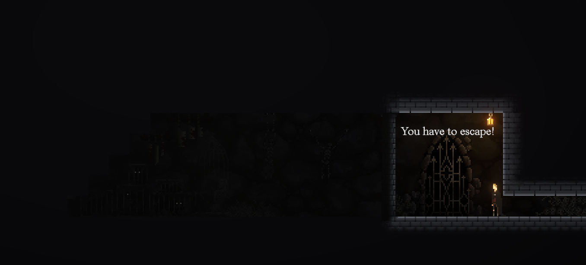

# Were.Wolf
Were.Wolf is a game with a dark theme where changing between your two forms is a means of survival. Instead of fighting the game's many evils you use transformation and movement to get past enemies, solve puzzles and traverse the different levels.

The game takes place in a large castle with varying areas where new dangers lurks around every corner. Experience the atmospheric backgrounds as they take you closer towards the castle's centre, and learn more about the mysterious world through NPC's and notes hidden throughout the fortress' corridors.

This is a student project made during a seven week period.

Get the game: https://yrgo-game-creator.itch.io/werewolf

## Screenshots

## Credits

### Programming
- Adam Forsell ([Aduman](https://github.com/Addehman))
- Jacob Lundberg ([MrJackey](https://github.com/MrJackey))
- Jonatan Johansson ([smeas](https://github.com/smeas))

### Art
- Alice Persdotter Rydberg ([denalice00](https://github.com/denalice00))
- Linda Davidsson ([noobLinda](https://github.com/noobLinda))
- Robin Ekström ([roeks001](https://github.com/roeks001))

### Music
- Robert Lundberg (https://soundcloud.com/dukeswe)